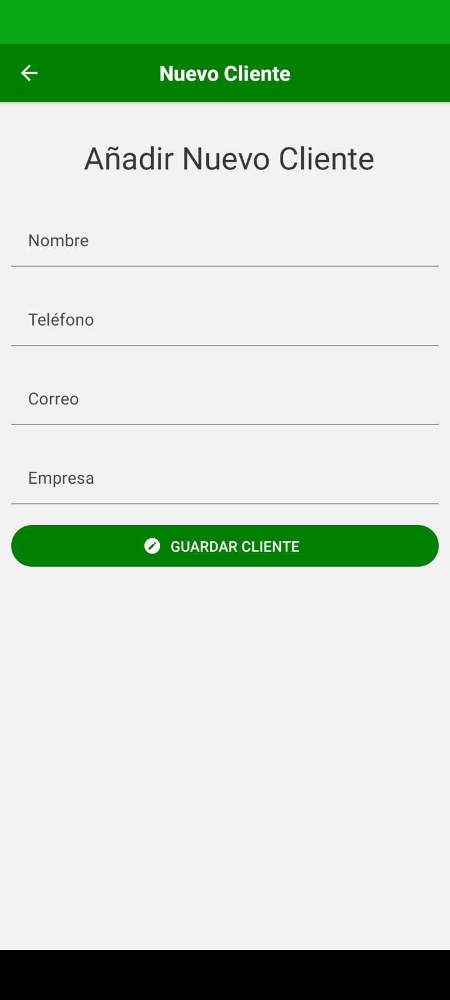

DEPENDENCIAS USADAS PARA REACT NAVIGATION + IMPORTS

- npm install @react-navigation/native

- npm install react-native-screens

- npm install react-native-safe-area-context

- npm install @react-navigation/native-stack

//IMPORTAR ESTO EN App.tsx 
import {NavigationContainer} from '@react-navigation/native';
import {createNativeStackNavigator} from '@react-navigation/native-stack';
 
const Stack = createNativeStackNavigator();

//////////////////////////////////////
PARA INSTALAR REACT NATIVE PAPER

- npm install react-native-paper

Con esta unica dependencia anduvo bien pero si tenes un proyecto "React Native Vanilla" tambien se necesita esta:

- npm install react-native-vector-icons (Hay que instalarla para poder usar los iconos)

//PARA USAR ICONOS
Aparte de instalar la dependencia hay que poner en android/app/build.gradle al final esto: 
apply from: "../../node_modules/react-native-vector-icons/fonts.gradle"

///////////////////////////////////////////////////////
INSTALACION DE JSON SERVER

- npm install -g json-server

luego crear el archivo db.json

para lanzar el srevidor 
- npx json-server --watch db.json

Para correrlo desde el celular conectado hay que cambiar la ip, del emulador de pc si lo detecta creo

- npx json-server --host "busco la ip con ipconfig" --port 3000  db.json

//////////////////////////////////////////////////////
INSTALACION DE AXIOS PARA MANEJAR LAS PETICIONES
-npm i axios

// COMANDO PARA RESETEAR CACHE
- npx react-native start --reset-cache

